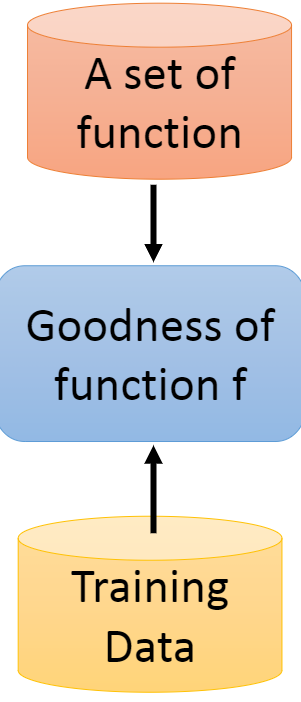
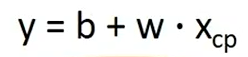
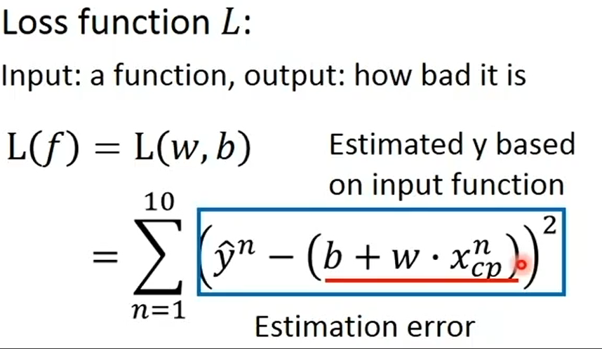

# Supervised Learning

## Regression(回归)

The output of the target function ƒ is "scalar"
函数的输出是一个标量(一个值)

### Basic Procedure

### Function Set

### Loss Function

以下为最常用的loss function定义，可自定义

产出Estimation error

### Gradient Descent

## Classification

1) Binary Classification

2) Multi-class Classification

### Linear Model

#### Deep Learning

#### SVM, decision tree, K-NN

### Structured Learning --Beyond Classification

# Semi-supervised Learning

# Transfer Learning

# Unsupervised Learning

# Reinforcement Learning