# Supervised Learning

## Regression(回归)

The output of the target function ƒ is "scalar"
函数的输出是一个标量(一个值)

### Basic Procedure

### Function Set

### Loss Function

以下为最常用的loss function定义，可自定义

产出Estimation error

### Gradient Descent

#### Loss function(square loss)

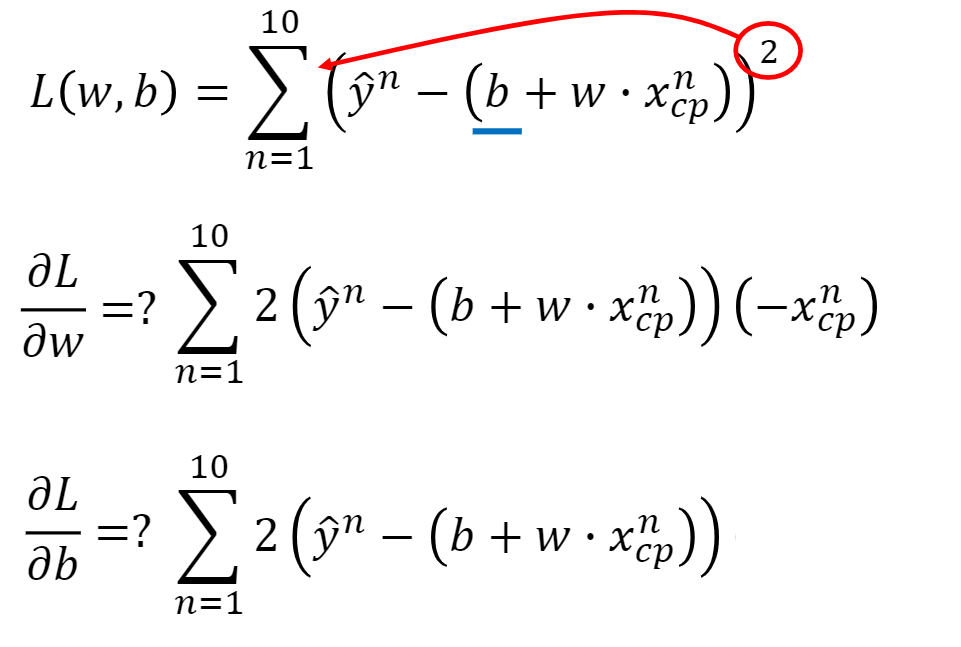

#### Update parameter

Adapt learning rate

##### Adagrad

η is learning rate

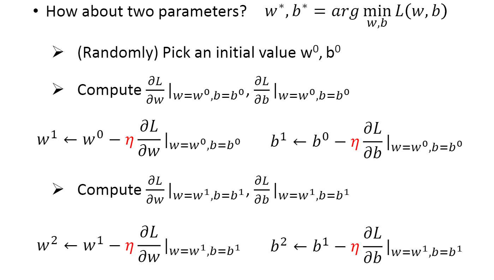
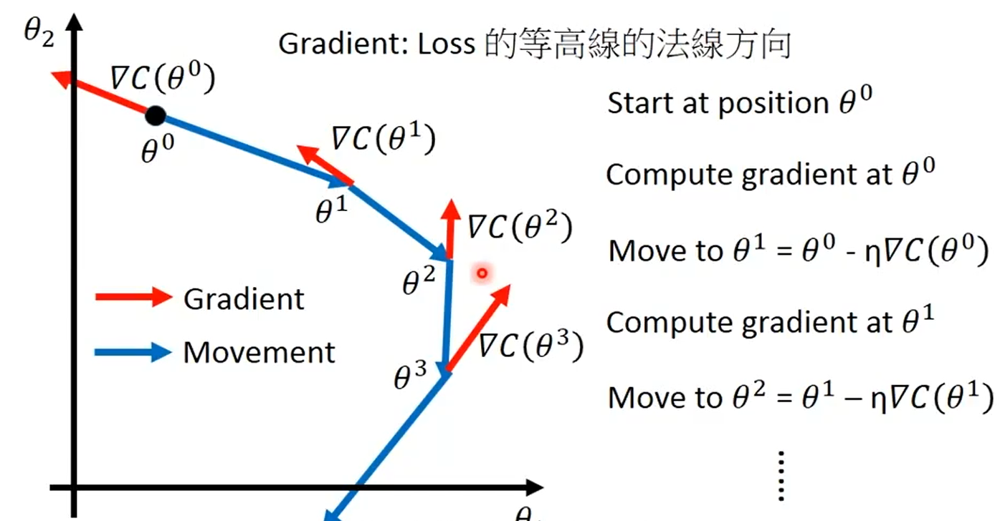

对learning rate进行改进，在让其随着迭代次数增加而减少的过程中除以以往每次梯度的平方和的根
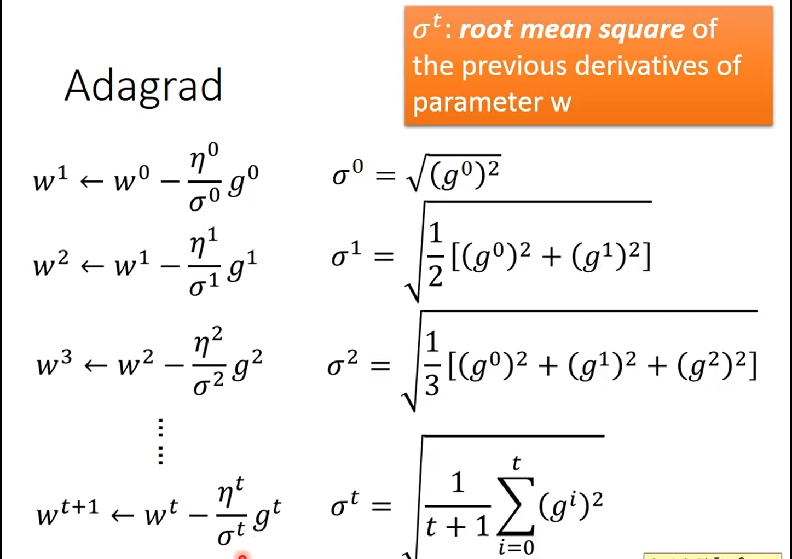

## Logistic regression

loss function use **hinge loss**, not square loss, for its' performence.

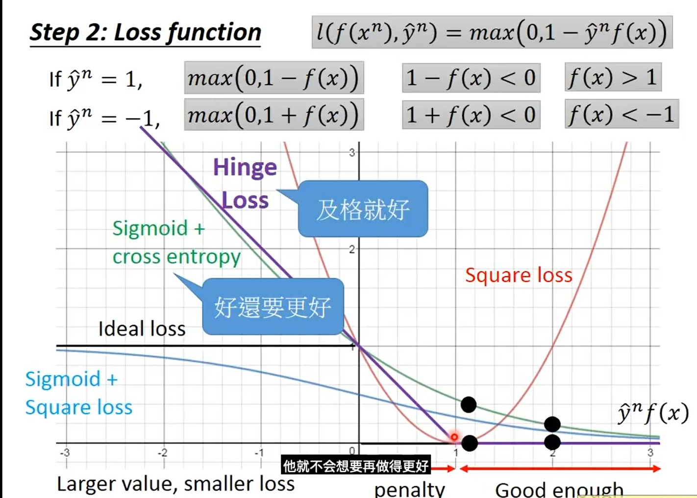

在对待已训练好的example时，hinge loss 选择无视，而cross entropy则仍有loss下降带来的驱动力

hinge loss 适合有outlier的情况，而cross entropy则会陷于outlier无法自拔

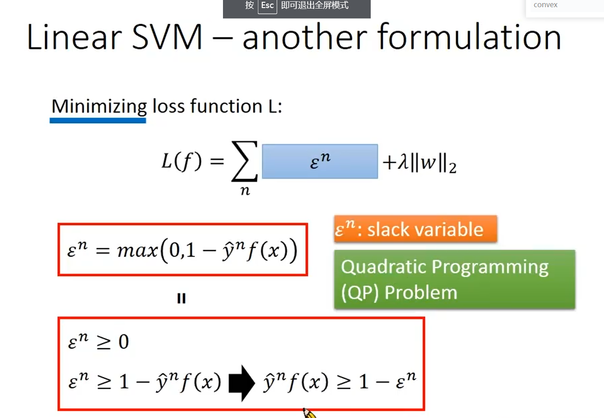

上下二式在minimizing的情况下是相同的，可以转化，故而可以对loss function进行微分，从而进行gradient descent。

## **判别模型（Discriminative Model）**

又可以称为条件模型，或条件概率模型。估计的是条件概率分布(conditional distribution)，p(class|context)。利用正负例和分类标签，主要关心判别模型的边缘分布。其目标函数直接对应于分类准确率。 （**判别模型多数放在分类**）

   主要特点：寻找不同类别之间的最优分类面，反映的是异类数据之间的差异。

   优点：（1）分类边界更灵活，比使用纯概率方法或生产模型得到的更高级；（2）能清晰的分辨出多类或某一类与其他类之间的差异特征；（3）在聚类、视角变化、部分遮挡、尺度改变等方面效果较好；（4）适用于较多类别的识别；（5）判别模型的性能比生成模型要简单，比较容易学习。

   缺点：（1）不能反映训练数据本身的特性，即能力有限，可以告诉你的是1还是2，但没有办法把整个场景描述出来；（2）缺少生成模型的优点，即先验结构的不确定性；（3）黑盒操作，即变量间的关系不清楚，不可视。

   常见的主要有：logistic regression、SVMs、traditional neural networks、Nearest neighbor、Conditional random fields。

   主要应用：Image and document classification、Biosequence analysis、Time series prediction。

##   **生成模型（Generative Model）**

又叫产生式模型。估计的是联合概率分布（joint probability distribution），p(class, context)=p(class|context)*p(context)。用于随机生成的观察值建模，特别是在给定某些隐藏参数情况下。在机器学习中，或用于直接对数据建模（用概率密度函数对观察到的样本数据建模），或作为生成条件概率密度函数的中间步骤。通过使用贝叶斯规则可以从生成模型中得到条件分布。如果观察到的数据是完全由生成模型所生成的，那么就可以拟合生成模型的参数，从而仅可能的增加数据相似度。但数据很少能由生成模型完全得到，所以比较准确的方式是直接对条件密度函数建模，即使用分类或回归分析。与描述模型的不同是，描述模型中所有变量都是直接测量得到。

## What to do with errors

### Bias(underfitting)

Model cannot even fit training examples, means that this model has large bias.

For this situation, redesign your model:

1. Add more features as input
2. A more complex model(take higher order variables into consideration, for example x2)

### Large variance(overfitting)

Model can fit the training data, but large error on testing data, means that this model provavly has large variance.

For this situation:

1. Collecting more data
2. Regularization

## Normalization

### Min-Max

使各影响因素产生的影响归一，通常映射到\[0,1], [-1,1]

![[公式]](Source/frac{x-x_{min}}{x_{max}-x_{min}}.svg+xml)

### Z-Score

将原有的数值分布转化为均值为0，方差为1的分布

![[公式]](Source/sigma+}.svg+xml)

## Classification

1) Binary Classification

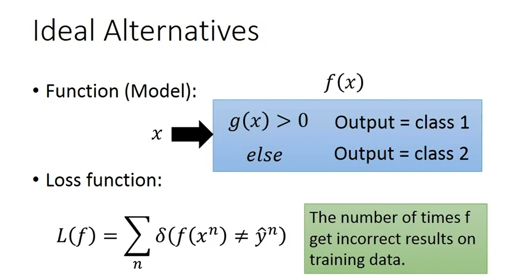

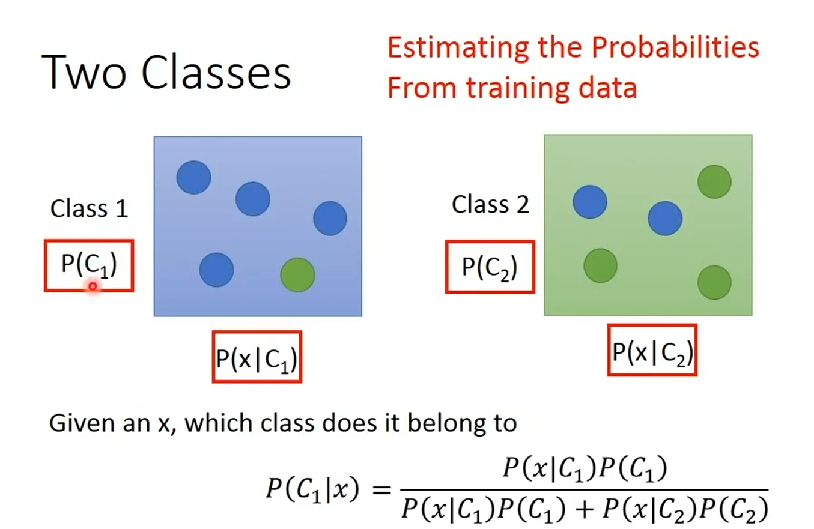

假设这些点是由在一个高斯分布中取得，为了获取这个高斯分布，我们需要求取所有高斯分布中，去除这些点的可能性最高的高斯分布

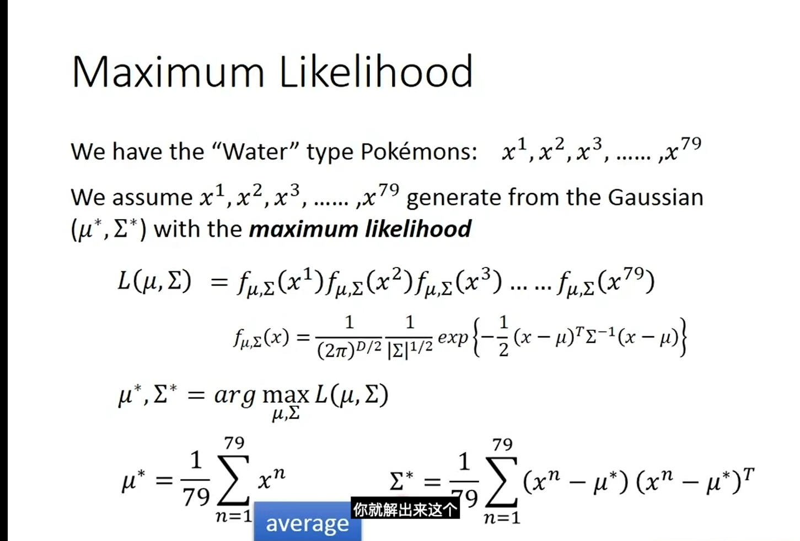

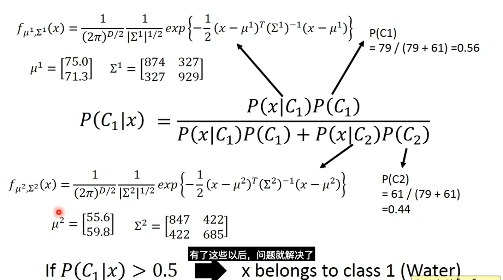

若几个class所体现的高斯分布的协方差矩阵不同，可能造成overfitting，所以将所有class的协方差矩阵设为相同的，留下不同的μ来进行调整，从而获得一个更优的model

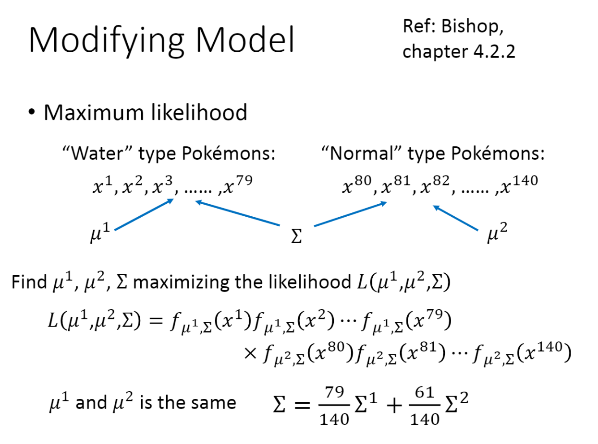

μ~1~和μ~2~的计算方法不变都是 mean(x~i~)，Σ=Σ的加权平均值

1) Multi-class Classification

### Linear Model

#### Deep Learning

#### SVM, decision tree, K-NN

### Structured Learning --Beyond Classification

# Semi-supervised Learning

# Transfer Learning

# Unsupervised Learning

# Reinforcement Learning