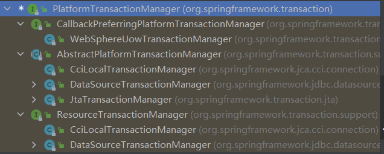

# IOC--Bean管理(xml配置文件进行配置)

Spring创建对象

Spring注入属性


## xml配置文件创建对象

```xml
<bean id="user" class="com.atguigu.spring5.User"></bean>
```

在配置文件中使用bean标签，标签里添加对应的属性

id：唯一标识

class：类的全路径（包类路径）

name：作用与id一致，但可以加特殊符号

ref：bean标签的id值

按以上过程创建类时，默认调用无参构造

## DI：依赖注入，就是注入属性

### set方法注入

#### 1.构造类

```java
public class Animal {
    String name;

    String categories;

    public void setCategories(String categories) {
        this.categories = categories;
    }

    public void setName(String name) {
        this.name = name;
    }
}
```

#### 2.配置xml

```xml
<bean id="animal" class="pig.testdemo.Animal">
    <!--property完成属性注入-->
	<property name="name" value="猪"></property>
    <property name="categories" value="哺乳动物"></property>
</bean>
```

### 有参构造函数注入

#### 1.构造类

```java
public class Insect {
    private String name;
    private String categories;
    private String extinct;

    public Insect(String name, String categories, String extinct) {
        this.name = name;
        this.categories = categories;
        this.extinct = extinct;
    }
}
```

#### 2.配置xml

```xml
    <bean id="insect" class="creature.testdemo.Insect">
        <!--
        <constructor-arg index="0" value=""/>
        <constructor-arg index="1" value=""/>
        <constructor-arg index="2" value=""/>
        -->
        <constructor-arg name="name" value="spider"></constructor-arg>
        <constructor-arg name="categories" value="spider"></constructor-arg>
        <constructor-arg name="extinct" value="no"></constructor-arg>
    </bean>
```

### p名称空间注入

可以简化set注入

#### 1.添加p名称空间在配置文件中

```xml
<?xml version="1.0" encoding="UTF-8"?>
<beans xmlns="http://www.springframework.org/schema/beans"
       xmlns:xsi="http://www.w3.org/2001/XMLSchema-instance"
       
       xmlns:p="http://www.springframework.org/schema/p"
       
       xsi:schemaLocation="http://www.springframework.org/schema/beans http://www.springframework.org/schema/beans/spring-beans.xsd">
</beans>
```

#### 2.在bean标签里面进行属性注入

```xml
    <bean id="animal" class="creature.Animal" p:name="猪" p:categories="哺乳动物">
    </bean>
```

## xml注入其他类型属性

### null值

```xml
<property name="address">
<null></null>
</property>
```

### 特殊符号

```xml
<property name="address">
	<value><![CDATA[<<南京>>]]></value>
</property>
```

### 外部bean

#### 1.创建两个类service  和 dao

#### 2.在service 中调用dao 里面的方法

```java
//一个接口类以及一个实现类
public interface UserDao {
    public void update();
}


public class UserDaoImpl implements UserDao{
    @Override
    public void update() {
        System.out.println("fucking pig");
    }


}
```

```java
public class AnimalService {

    UserDao userDao ;

    public void setUserDao(UserDao userDao) {
        this.userDao = userDao;
    }

    public void add(){
        System.out.println("service add............");
        userDao.update();
    }
}

```


#### 3.在spring配置文件中配置

```xml
    <bean id="animalservice" class="creature.service.AnimalService">
        <!--通过property 使用set方法注入属性-->
        <property name="userDao" ref="userdao"></property>
    </bean>
    <bean id="userdao" class="creature.dao.UserDaoImpl"></bean>
```


### 内部bean和级联赋值

一对多关系：部门和员工

```java
//员工类
public class Employee {
    private String ename;
    private String gender;
    private Department department;

    public void setEname(String ename) {
        this.ename = ename;
    }

    public void setGender(String gender) {
        this.gender = gender;
    }

    public void setDepartment(Department department) {
        this.department = department;
    }
}

//部门类
public class Department {
    private String dname;

    public void setDname(String dname) {
        this.dname = dname;
    }
}

```

#### xml配置文件中进行配置（内部bean）

```xml
    <bean id="emp" class="creature.firm.Employee">
        <property name="ename" value="pigsy"></property>
        <property name="gender" value="female"></property>
        <!--内部bean方式进行配置-->
        <property name="department">
            <bean id="dep" class="creature.firm.Department">
                <property name="dname" value="饲料课"></property>
            </bean>
        </property>

    </bean>
```

#### 级联赋值

##### 1.外部bean方式创建对象，并赋值，通过ref引用

```xml
    <bean id="emp" class="creature.firm.Employee">
        <property name="ename" value="dogsy"></property>
        <property name="gender" value="male"></property>
        <property name="department" ref="dept"></property>
    </bean>
    <bean id="dept" class="creature.firm.Department">
        <property name="dname" value="垃圾场"></property>
    </bean>
```

##### 2.通过set与get方法进行赋值

```xml
    <bean id="emp" class="creature.firm.Employee">
        <property name="gender" value="male"></property>
        <property name="ename" value="monkey"></property>
        <property name="department" ref="dept"></property>
        <!--以下需要get方法-->
        <property name="department.dname" value="狗粮"></property>
    </bean>
    <bean id="dept" class="creature.firm.Department">
        <property name="dname" value="猪食"></property>
    </bean>
```

## xml注入集合类型属性

数组类型

List集合类型

Map集合类型

### 1.创建相应类型

```java
public class Student {

    private String[] courses;

    private List<String> list;

    private Map<String, String> maps;

    private Set<String> set;

    public void setSet(Set<String> set) {
        this.set = set;
    }

    public void setCourses(String[] courses) {
        this.courses = courses;
    }

    public void setList(List<String> list) {
        this.list = list;
    }

    public void setMaps(Map<String, String> maps) {
        this.maps = maps;
    }
}

```

### 2.xml进行配置

```xml
    <bean id="student" class="spring5.collectiontype.Student">
        <property name="data" value="20"></property>
        <property name="courses">
            <array><!--list也可-->
                <value>java</value>
                <value>数据库</value>
            </array>
        </property>
        <property name="list">
            <list>
                <value>鳖</value>
                <value>王八</value>
                <value>乌龟</value>
            </list>
        </property>
        <property name="maps">
            <map>
                <entry key="Java" value="java"></entry>
                <entry key="C#" value="C#"></entry>
            </map>
        </property>
        <property name="set">
            <set>
                <value>1</value>
                <value>3</value>
            </set>
        </property>
    </bean>
```

## xml注入集合类型属性（集合中存储对象类型值）

```java
public class Course {

    private String name;

    public void setName(String name) {
        this.name = name;
    }
}
```

```java
public class Student {
    private List<Course> coursesList;

    public void setCoursesList(List<Course> coursesList) {
        this.coursesList = coursesList;
    }
}
```

```xml
    <bean id="student" class="spring5.collectiontype.Student"><property name="coursesList">
            <list>
                <ref bean="course1"></ref>
                <ref bean="course2"></ref>
            </list>
        </property>
    </bean>
    <bean id="course1" class="spring5.collectiontype.Course">
        <property name="name" value="Java"></property>
    </bean>
    <bean id="course2" class="spring5.collectiontype.Course">
        <property name="name" value="JDBC"></property>
    </bean>
```


## xml集合注入部分提取出来公用

### 1.xml中引入util名称空间

```xml
<beans xmlns="http://www.springframework.org/schema/beans"
       xmlns:xsi="http://www.w3.org/2001/XMLSchema-instance"
       xmlns:util="http://www.springframework.org/schema/util"
       xsi:schemaLocation="http://www.springframework.org/schema/beans http://www.springframework.org/schema/beans/spring-beans.xsd
                           http://www.springframework.org/schema/util http://www.springframework.org/schema/util/spring-util.xsd">
    
</beans>
```

### 2.提取list集合类型属性注入使用

```xml
   <util:list id="bookList">
        <value>母猪的产后护理</value>
        <value>法兰街舞厅入门手册</value>
        <value>精通人性的生活指南</value>
    </util:list>
    <bean id="book" class="spring5.collectiontype.Book">
        <property name="list" ref="bookList"></property>
    </bean>
```

## FactoryBean

Spring有两种类型的bean，一种普通bean，一种工厂bean（factorybean）

普通bean：xml中定义是什么类型就返回什么类型

工厂bean：xml中返回类型可以不一样

### 1.创建类并实现接口的方法，在实现方法中定义返回的bean的类型

需要继承FactoryBean

并以泛型的方式设置返回类型

```java
public class MyBean implements FactoryBean<Course> {
    @Override
    public Course getObject() throws Exception {
        Course course = new Course();
        course.setName("fuck");
        return course;
    }

    @Override
    public Class<?> getObjectType() {
        return null;
    }
}
```

### 2.xml正常配置

```xml
    <bean id="myBean" class="spring5.factorybean.MyBean">
    </bean>
```

## bean作用域

在spring中设置bean是单实例还是多实例

默认情况下是单实例模式

### 如何设置单实例还是多实例

xml的bean标签中的scope属性值

默认值为 singleton 为单实例，在加载xml配置文件是就会创建对象

可选值 prototype为多实例模式，只有在调用getBean方法的时候才会去创建对象

request

session

```xml
    <bean id="myBean" class="spring5.factorybean.MyBean" scope="singleton">
    </bean>
```

## bean生命周期

1）通过构造器创建bean实例

2）为bean的属性设置值和对其他bean的引用（调用set方法）

3）调用bean初始化的方法（需要进行配置）

4）bean使用（对象获取到了）

5）当容器关闭是，调用bean的销毁方法（需进行配置）

### 演示bean生命周期

```java
public class Orders {

    private String oName;

    public Orders() {
        System.out.println("第一步");
    }

    public void setoName(String oName) {
        System.out.println("第二步");
    }

    public void initMethod(){
        System.out.println("第三步");
    }

    public void destroyMethod(){
        System.out.println("第五步");
    }
}

//测试类
public void testOrders(){
        ApplicationContext context = new ClassPathXmlApplicationContext("bean3.xml");

        Orders orders = context.getBean("orders", Orders.class);
        System.out.println("第四步");

        ((ClassPathXmlApplicationContext)context).close();

}
```

```xml
    <bean id="orders" class="spring5.bean.Orders" init-method="initMethod" destroy-method="destroyMethod">
        <property name="oName" value="wangba"></property>
    </bean>
```

### bean的后置处理器

1）通过构造器创建bean实例

2）为bean的属性设置值和对其他bean的引用（调用set方法）

后置1）把bean实例传递bean后置处理器的方法

执行postProcessBeforeInitialization()

3）调用bean初始化的方法（需要进行配置）

后置2）把bean实例传递bean后置处理器的方法

执行postProcessAfterInitialization()

4）bean使用（对象获取到了）

5）当容器关闭是，调用bean的销毁方法（需进行配置）

### 演示bean后置处理器

```java
public class MyBeanPost implements BeanPostProcessor {

    @Override
    public Object postProcessBeforeInitialization(Object bean, String beanName) throws BeansException {
        System.out.println("do before init");
        return bean;
    }

    @Override
    public Object postProcessAfterInitialization(Object bean, String beanName) throws BeansException {
        System.out.println("do after init");
        return bean;
    }

}
```

```xml
    <bean id="orders" class="spring5.bean.Orders" scope="singleton" init-method="initMethod" destroy-method="destroyMethod">
        <property name="oName" value="wangba"></property>
    </bean>

    <!--配置后置处理器  会为当前配置文件的所有实例添加后置处理器（只要该类impl了BeanPostProcessor）-->
    <bean id="myBeanPost" class="spring5.bean.MyBeanPost"></bean>
```

## xml自动装配

根据指定装配规则（属性名称或属性类型），spring将自动匹配的属性值进行注入

### 演示自动装配过程

```xml
    <!--实现自动装配
        byName 根据属性名称进行注入
        要求bean的id与实际类的属性名称相同
        byType 根据属性类型进行注入
        要求bean的type与实际类的属性类型相同
    -->
    <bean id="employee" class="spring5.autowire.Employee" autowire="byName"></bean>
    <bean id="department" class="spring5.autowire.Department"></bean>
```

## 外部属性文件

### 1.直接配置数据库信息（以德鲁伊数据库为例）

```xml
    <bean id="dataSource" class="com.alibaba.druid.pool.DruidDataSource">
        <property name="driverClassName" value="com.mysql.jdbc.Driver"></property>
        <property name="url" value="jdbc:mysql://localhost:3306/userDb"></property>
        <property name="username" value="root"></property>
        <property name="password" value="root"></property>
    </bean>
```


### 2.引入外部属性文件

```xml
    <context:property-placeholder location="classpath:jdbc.properties"

    <bean id="dataSource" class="com.alibaba.druid.pool.DruidDataSource">
        <property name="driverClassName" value="${prop.draverClass}"></property>
        <property name="url" value="${prop.url}"></property>
        <property name="username" value="${prop.userName}"></property>
        <property name="password" value="${prop.password}"></property>
    </bean>
```

# IOC--Bean管理（基于注解方式）

目的是简化xml配置

## 针对bean管理创建对象提供注解

1）@Component

2）@Service

3）@Controller

4）@Repository

*以上四个注解功能一样，均可创建bean实例

## 基于注解方式创建对象

1）引入spring-aop依赖

2）开启组件扫描

xml配置

```xml
<!--开启组件扫描
        如果扫描多个包，中间加逗号
        或输入上级包
    -->
    <context:component-scan base-package="spring5.dao,spring5.service"></context:component-scan>

```

用户类

```java
//在注解中value可不写（默认值为首字母小写）
@Component(value = "userService")//形同<bean id="userService" class=".."/>
public class UserService {

    public void add(){
        System.out.println("UserService activated");
    }
}
```

### 自动扫描细节属性

user-default-filters 表示不使用默认filter（默认是所有标签）

include-filter 设置扫描哪些内容

```xml
    <context:component-scan base-package="spring5.service" use-default-filters="false">
        <context:include-filter type="annotation" expression="org.springframework.stereotype.Controller"/>
    </context:component-scan>
```

exclude-filter设置不扫描哪些内容

```xml
<context:component-scan base-package="spring5.dao">
        <context:exclude-filter type="annotation" expression="org.springframework.stereotype.Repository"/>
    </context:component-scan>
```

## 基于注解方式实现属性注入

xml配置文件需配置自动装配

1）@Autowired：根据属性类型自动注入

```java
//UserDao
public interface UserDao {


    public void add();
}


//UserDao实现类
@Repository
public class UserDaoImpl implements UserDao{

    @Override
    public void add() {
        System.out.println("UserDaoImpl activated");
    }
}

//UserService类
//在注解中value可不写（默认值为首字母小写）
@Service(value = "userService")//形同<bean id="userService" class=".."/>
public class UserService {

    //无需set方法，底层自带
    @Autowired
    private UserDao userDao;

    public void add(){
        System.out.println("UserService activated");
    }
}

```

2）@Qualifier：根据属性名称进行注入

该标签需要与@Autowire一起使用

```java
    @Autowired
    @Qualifier(value = "userDaoImpl")
    private UserDao userDao;
```

3）@Resource：可以根据类型或名称

jdk15已移除

4）@Value：注入普通类型（以上三种针对引用类型）

```java
    @Value(value = "pig")
    private String name;
```

## 完全注解开发

1）创建配置类，替代xml

```java
@Configuration//标记此为配置文件
@ComponentScan(basePackages = "spring5")//形同<context:component-scan base-package="spring5.dao,spring5.service"></context:component-scan>
public class SpringConfig {
}

```

2）编写测试类

```java
    @Test
    public void testConfig(){
        //加载配置类
        ApplicationContext context = new AnnotationConfigApplicationContext(SpringConfig.class);

        UserService userService = context.getBean("userService", UserService.class);
        userService.add();
    }
```

# AOP

不改变源代码就可以增加功能

增强功能大致形式

```java
public void method1(){
    super.method1();
    //增强部分
}
```


## 1.有接口情况

创建接口实现类代理对象

## 2.无接口情况

创建子类的代理对象

## AOP（JDK动态代理）

使用proxy类里的方法创建代理对象

### 1）调用newProxyInstance方法

```java
static Object newProxyInstance(ClassLoader loader, class<?>[] interfaces, InvocationHandler)
```

第一参数，类加载器

第二参数，增强方法所在的类这个类实现的接口，支持多个接口

第三参数，实现这个类的InvocationHandler，创建代理对象，写增强的方法

### 2）编写InvocationHandler的子类

编写其中的invoke方法

```java
class UserDaoImpl implements UserDao{

    private Object obj;
    public void setObj(Object obj){
        this.obj = obj;
    }
	public Object invoke(Object proxy, Method method, Object[] args){
	//before
    Object obj = method.invoke(obj, args);
	//after
    }
}
```

### AOP操作（准备）

Spring框架一般是基于Aspectj实现AOP操作，Aspectj独立于Spring与AOP框架，一般与Spring一起使用

#### 导入依赖

#### 1）基于xml配置文件实现

#### 2）基于注解方式实现

### 切入点表达式

execution(\[权限修饰符\]\[返回类型\]\[类全路径\]\[方法名称\]\([参数列表\])

#### 对com.atguigu.dao.BookDao类里面的add进行增强

execution(* com.atguigu.dao.BookDao.add(..))

\*代表全部权限 

..代表参数列表

#### 对com.atguigu.dao所有类里面的所有方法进行增强

execution(* com.atguigu.dao.\*.\*(..))

## AspectJ注解方式增强

创建两个类

开启**自动扫描**

使用注解创建对象

在增强类上添加注解@Aspect

在spring配置文件中开启生成代理对象/使用注解开启代理对象

在增强类里在作为通知的方法上面添加类型注解，并使用切入点表达式

```java
@Component
public class Dog {

    public void bark(){
        System.out.println("fucking pig............");
    }
}

//被UserProxy增强的类
@Component
public class User {

    @Autowired
    private Dog dog;

    public void add(){
        dog.bark();
        //int a = 10/0;
        System.out.println("User add.............");
    }
}

//User增强类
@Component
@Aspect
public class UserProxy {

    @Before(value = "execution(* spring5.aopanno.User.add(..))")
    public void beforeAdd(){
        System.out.println("before User exec...........");
    }

    @After(value = "execution(* spring5.aopanno.User.add(..))")
    public void afterAdd(){
        System.out.println("after User exec...........");
    }

    @AfterThrowing(value = "execution(* spring5.aopanno.User.add(..))")
    public void afterThrowing(){
        System.out.println("afterThrowing ...................");
    }

    @AfterReturning(value = "execution(* spring5.aopanno.User.add(..))")
    public void afterReturning(){
        System.out.println("afterReturning................");
    }

    @Around(value = "execution(* spring5.aopanno.User.add(..))")
    public void around(ProceedingJoinPoint proceedingJoinPoint) throws Throwable {
        System.out.println("around before User exec");

        proceedingJoinPoint.proceed();

        System.out.println("around after User exec");
    }
}
```

```java
@Configuration
@ComponentScan(basePackages = "spring5.aopanno")
@EnableAspectJAutoProxy(proxyTargetClass = true)//true使用cglib代理，false使用jdk代理
public class SpringConfig {
}

```

在未出现异常时，执行顺序如下

```
around before User exec
before User exec...........
fucking pig............
User add.............
afterReturning................
after User exec...........
around after User exec
```

出现异常时,执行顺序如下

around before User exec
before User exec...........
fucking pig............
afterThrowing ...................
after User exec...........

## 细节问题

### 相同的切入点进行抽取

```java
//User增强类
@Component
@Aspect
public class UserProxy {

    
    //提取切入点
    @Pointcut(value = "execution(* spring5.aopanno.User.add(..))")
    public void pointDemo(){

    }

    
    //通过方法名调用
    @Before(value = "pointDemo()")
    public void beforeAdd(){
        System.out.println("before User exec...........");
    }
}
```

### 多个增强类对同一个方法进行增强

可设置优先级对执行顺序进行调整（数值越小优先级越高）

```java
@Component
@Aspect
@Order(3)
public class PersonProxy 

@Component
@Aspect
@Order(1)
public class UserProxy 
```

## AspectJ配置文件增强

创建两个类

在spring配置文件中创建两个类对象

在spring配置文件中配置切入点

```xml
    <bean id="user" class="spring5.aopxml.User"></bean>
    <bean id="userProxy" class="spring5.aopxml.UserProxy"></bean>

    <!--配置aop增强-->
    <aop:config>
        <!--配置切入点-->
        <aop:pointcut id="p" expression="execution(* spring5.aopxml.User.add(..))"/>
        <!--配置切面-->
        <aop:aspect ref="userProxy">
            <aop:before method="beforeAdd" pointcut-ref="p"></aop:before>
        </aop:aspect>
    </aop:config>
```

# JdbcTemplate（spring_demo6)

Spring对JDBC进行封装，使用JdbcTemplate方便实现对数据库的操作

## 导入依赖

```xml
        <dependency>
            <groupId>com.github.spt-oss</groupId>
            <artifactId>mysql-connector-java-plus</artifactId>
            <version>0.1.0</version>
        </dependency>    
		<!-- https://mvnrepository.com/artifact/mysql/mysql-connector-java -->
        <dependency>
            <groupId>mysql</groupId>
            <artifactId>mysql-connector-java</artifactId>
            <version>8.0.27</version>
        </dependency>
        <!-- https://mvnrepository.com/artifact/org.springframework/spring-jdbc -->
        <dependency>
            <groupId>org.springframework</groupId>
            <artifactId>spring-jdbc</artifactId>
            <version>5.3.14</version>
        </dependency>
        <!-- https://mvnrepository.com/artifact/com.alibaba/druid -->
        <dependency>
            <groupId>com.alibaba</groupId>
            <artifactId>druid</artifactId>
            <version>1.2.8</version>
        </dependency>
        <!-- https://mvnrepository.com/artifact/org.springframework/spring-tx -->
        <dependency>
            <groupId>org.springframework</groupId>
            <artifactId>spring-tx</artifactId>
            <version>5.2.19.RELEASE</version>
        </dependency>
```

## 配置druid连接池（使用.properties）以及jdbctemplate对象

```properties
druid.url=jdbc:mysql://82.156.203.114:3306/springjdbctemp
druid.username=pigsy
druid.password=zhangchi000406
druid.driverClassName=com.mysql.jdbc.Driver
```

```java
@Configuration
@ComponentScan(basePackages = {"mapper","service"})
@EnableTransactionManagement
public class JDBCConfig {

    @Bean
    public JdbcTemplate jdbcTemplate(DataSource dataSource) throws IOException {
        JdbcTemplate jdbcTemplate = new JdbcTemplate(dataSource);
        return jdbcTemplate;
    }

    @Bean
    public DruidDataSource druidDataSource() throws IOException {
        DruidDataSource druidDataSource = new DruidDataSource();
        Properties properties = new Properties();
        BufferedReader bufferedReader = new BufferedReader(new FileReader("D:\\github\\spring_demo6\\src\\main\\resources\\application.properties"));
        properties.load(bufferedReader);
        druidDataSource.configFromPropety(properties);
        return druidDataSource;
    }

    @Bean
    public DataSourceTransactionManager dataSourceTransactionManager(DataSource dataSource) throws IOException {
        return new DataSourceTransactionManager(dataSource);
    }
}
```

## 对数据库进行维护

### 创建entity实体类

需要与数据库中的对应上

```java
public class User {
    private int userId;

    private String username;

    private String userstatus;

	//getter and setter for every parameter
}
```

### 编写service和mapper

mapper中编写数据库相关操作

调用jdbcTemplate对象里面的update方法实现添加操作

### 添加/删除/修改表项

```java
@Repository
public interface UserDao {

    void addUser(User user);

    void deleteUser(int id);

    void updateUser(User user);
}


@Repository
public class UserDaoImpl implements UserDao {

    @Autowired
    private JdbcTemplate jdbcTemplate;

    @Override
    public void addUser(User user) {
        String sql = "insert into t_user values(?,?,?)";
        Object[] args = {user.getUserId(), user.getUsername(), user.getUserstatus()};
        System.out.println(jdbcTemplate.update(sql,args));
    }

    @Override
    public void deleteUser(int id) {
        String sql = "delete from t_user where f_user_id=?";
        jdbcTemplate.update(sql, id);
    }

    @Override
    public void updateUser(User user) {
        String sql = "update t_user set f_user_name=?,f_user_status where f_user_id=?";
        Object[] args = {user.getUsername(), user.getUserstatus(), user.getUserId()};
        jdbcTemplate.update(sql,args);
    }
}


@Service
public class UserService {

    @Autowired
    private UserDao userDao;

    public void addBook(User user){
        userDao.add(user);
    }
}

public class TestUser {

    public void testJdbcTemplate(){
        ApplicationContext context =
                new AnnotationConfigApplicationContext(JDBCConfig.class);
        UserService userService = context.getBean("userService", UserService.class);

//        添加
//        User user = new User();
//        user.setUserId(1);
//        user.setUsername("pigsy");
//        user.setUserstatus("broken");
//        userService.addUser(user);


        //更新
//        User user = new User();
//        user.setUserId(1);
//        user.setUsername("dogsy");
//        user.setUserstatus("perfect");
//        userService.updateUser(user);

        //删除
        int id = 1;
        userService.deleteUser(id);
    }
}
```

### 查询表项

查询返回某个值

查询返回对象

查询返回集合

见UserDao,UserDaoImpl,UserService

### 批量操作

batchUpdate(String sql, List<Object[]> batchArgs)

见UserDao,UserDaoImpl,UserService

# 事务

数据库操作最基本单元，逻辑上一组操作，要么都成功，如果有一个失败，所有操作都失败。

## 事务的特性（ACID）

1. 原子性
2. 一致性
3. 隔离性
4. 持久性

## 事务操作过程

```java
public void accountMoney(){
    try{
        //第一步 开启事务
        
        //第二步 进行业务操作
        
        userDao.reduceMoney();
        userDao.addMoney();
        
        //第三步 没有发生异常，提交事务
        
    }catch(Exception e){
        //出现异常，事务回滚
    }
}
```

## 用Spring框架实现事务

一般加到spring的service层中

有两种方式

1. 编程式事务管理（见上）
2. 声明式事务管理

声明式事务管理底层使用AOP原理

### spring事务管理API

提供一个接口，代表事务管理器，这个接口针对不同的框架提供不同的实现类

以下是事务管理器



#### 配置事务管理器

```java
//JDBCConfig

@Configuration
@ComponentScan(basePackages = {"mapper","service"})
public class JDBCConfig {

    @Bean
    public JdbcTemplate jdbcTemplate() throws IOException {
        JdbcTemplate jdbcTemplate = new JdbcTemplate(druidDataSource());
        //使用getbean获取druidDataSource对象
        return jdbcTemplate;
    }

    @Bean
    public DruidDataSource druidDataSource() throws IOException {
        DruidDataSource druidDataSource = new DruidDataSource();
        Properties properties = new Properties();
        BufferedReader bufferedReader = new BufferedReader(new FileReader("D:\\github\\spring_demo6\\src\\main\\resources\\application.properties"));
        properties.load(bufferedReader);
        druidDataSource.configFromPropety(properties);
        return druidDataSource;
    }

    //事务管理器
    @Bean
    public DataSourceTransactionManager dataSourceTransactionManager(){
        ApplicationContext context = new AnnotationConfigApplicationContext(JDBCConfig.class);
        DruidDataSource druidDataSource = context.getBean("druidDataSource", DruidDataSource.class);
        return new DataSourceTransactionManager(druidDataSource);
    }
}
```

#### 开启事务注解

```java
@EnableTransactionManagement

	//@mapper AccountDao
	void addMoney();

    void reduceMoney();
	//@mapper AccountDaoImpl
	@Override
    public void addMoney() {
        String sql = "update t_account set f_money=f_money+100 where f_id=\"1\"";
        jdbcTemplate.update(sql);
    }

    @Override
    public void reduceMoney() {
        String sql = "update t_account set f_money=f_money-100 where f_id=\"2\"";
        jdbcTemplate.update(sql);
    }
```

#### @Transactional()相关参数


##### propagation：事务传播行为

​		事务传播行为用来描述由某一个事务传播行为修饰的方法被嵌套进另一个方法的时事务如何传播。共有7种


##### isolation：事务隔离级别

多事务操作之间不会产生影响。

有三个读问题：脏读，不可重复读，虚度

脏读：一个未提交事务读取到另一个未提交事务的数据

不可重复读：一个未提交事务读取到另一个提交事务的数据

虚读：前后多次读取，数据总量不一致

通过设置事务的隔离级别可以解决上述问题


timeout：超时时间

事务需要在一定时间内进行提交，如果不提交便回滚

readOnly：是否只读

针对数据库的操作是否只能进行查询

rollbackFor：回滚

出现那些异常进行回滚

noRollbackFor：不回滚

出现那些异常不进行回滚

# Spring5框架新功能

1. Spring5框架代码基于Java8，运行时兼容JDK9，删除了许多不建议使用的类和方法
2. Spring5框架自带了通用的日志封装

（1） 移除了Log4jConfigListener，建议使用Log4j2

## （2） Spring5整合Log4j2

xml配置方式

log4j2.xml放于resources中

简单配置

```xml
<?xml version="1.0" encoding="UTF-8"?>
<!--日志级别以及优先级排序:OFF > FATAL > WARN > INFO > DEBUG > TRACE > ALL -->
<Configuration status="DEBUG">
    <Appenders>
        <!-- 默认打印到控制台 -->
        <Console name="Console" target="SYSTEM_OUT">
            <!-- 默认打印格式 -->
            <PatternLayout pattern="%d{yyyy-MM-dd HH:mm:ss.SSS} [%t] %-5level %logger{36} - %msg%n"/>
        </Console>
    </Appenders>
    <Loggers>
        <!-- 默认打印日志级别为 error -->
        <Root level="info">
            <AppenderRef ref="Console"/>
        </Root>
    </Loggers>
</Configuration>
```

多功能配置

```xml
<?xml version="1.0" encoding="UTF-8"?>
<!--日志级别以及优先级排序: OFF > FATAL > ERROR > WARN > INFO > DEBUG > TRACE > ALL -->
<!--Configuration后面的status，这个用于设置log4j2自身内部的信息输出，可以不设置，当设置成trace时，你会看到log4j2内部各种详细输出-->
<!--monitorInterval：Log4j能够自动检测修改配置 文件和重新配置本身，可设置一个非零的间隔秒数来检测配置变更 -->
<Configuration status="WARN" monitorInterval="60">
    <!-- 自定义一些变量 -->
    <Properties>
        <!-- 变量定义 -->
        <Property name="log_base_dir">/app_data/logs/my_app</Property>
        <!-- Appender在将日志数据写入目标位置之前，一般会将日志数据通过Layout进行格式化。PatternLayout可以使用与C语言printf函数类似
        的转换模式来指定输出格式。常见的配置如下：
        - %d{yyyy-MM-dd HH:mm:ss.SSS} : 日志生成时间，输出格式为“年-月-日 时:分:秒.毫秒”
        - %p : 日志输出格式
        - %c : logger的名称
        - %m : 日志内容，即 logger.info("message")
        - %n : 换行符
        - %T : 线程号
        - %L : 日志输出所在行数
        - %M : 日志输出所在方法名 -->
        <Property name="log_pattern">[%d{yyyy-MM-dd HH:mm:ss.SSS}][%-5p][%T][%c.%M:%L] %msg%xEx%n</Property>
        <!-- 单个日志文件最大大小，单位可以是KB, MB or GB -->
        <Property name="max_single_file_size">1MB</Property>
    </Properties>

    <!-- 使用Appenders元素可以将日志事件数据写到各种目标位置（目前可以为控制台、文件、多种数据库API、远程套接字服务器、Apache Flume、
    JMS、远程UNIX Syslog daemon），其内的每个Appender都必须要有一个name属性作为唯一标识，该标识的值在Logger中通过AppenderRef来引
    用，从而将该Appender配置到该Logger中 -->
    <Appenders>
        <!-- Console Appender常用于将日志输出到System.out，一般用在开发环境 -->
        <Console name="Console" target="SYSTEM_OUT">
            <!-- 只接受程序中DEBUG级别的日志进行处理-->
            <ThresholdFilter level="DEBUG" onMatch="ACCEPT" onMismatch="DENY"/>
            <!-- 在大多数情况下，Appender将格式化LogEvent的责任委托给Layout -->
            <PatternLayout pattern="${log_pattern}"/>
        </Console>

        <!-- RollingFile Appender会将日志输出到fileName属性指定的文件中，且需要指定TriggeringPolicy和RolloverStrategy。其中
        TriggeringPolicy决定是否生成新的日志文件，RolloverStrategy决定如何生成新的日志文件。如果没有配置RolloverStrategy，则会
        使用DefaultRolloverStrategy。从2.5开始，可以在DefaultRolloverStrategy中配置一个自定义的删除动作。从2.8开始，如果没有指定
        文件名，则会使用DirectWriteRolloverStrategy来代替DefaultRolloverStrategy -->
        <!-- 这个RollingFile Appender会打印出所有的DEBUG及以下级别（DEBUG、INFO、ERROR、FATAL、OFF）的信息 -->
        <RollingFile name="DebugLogRollingFile" fileName="${log_base_dir}/my_app_debug.log"
                     filePattern="${log_base_dir}/$${date:yyyy_MM_dd}/my_app_debug_%d{yyyy_MM_dd_HH}_%i.log.gz">
            <ThresholdFilter level="DEBUG" onMatch="ACCEPT" onMismatch="DENY"/>
            <PatternLayout pattern="${log_pattern}" charset="UTF-8"/>
            <!-- Policies表示一个CompositeTriggeringPolicy，可以组合多个TriggeringPolicy，只要内部的任意一个TriggeringPolicy
            满足触发条件，都会滚动日志 -->
            <Policies>
                <!-- TimeBasedTriggeringPolicy用于按时间滚动日志。只要filePattern属性值中的日期/时间模式（pattern）不再应用于当
                前文件时就进行日志滚动。这种规则通过interval和modulate属性来配置。interval属性指定一个整数，用于基于日期/时间模式中
                的最小的时间单位数滚动一次。例如，filePattern值为/app_data/logs/my_app/$${date:yyyy_MM_dd}/my_app_%d{yyyy_
                MM_dd_HH}_%i.log，这里使用小时作为最小的时间单位时，假如interval参数值为4，则表示每4小时滚动一次。默认值为1。
                modulate表示是否调整interval属性值以便下次滚动发生在interval边界处。如果时间最小单位为小时，当前时间为早上3点，间隔
                为4小时，则第一次滚动将发生在早上4点时（而不是早上7点），后续滚动将发生在早上8点、中午12点、下午4点等时刻 -->
                <TimeBasedTriggeringPolicy interval="1" modulate="false"/>
                <!-- SizeBasedTriggeringPolicy用于按文件大小滚动日志。每当日志文件超过size指定的大小（一般不超过几十MB，否则使用软
                件打开导出的日志时很不方便），则这size大小的日志会自动存入按filePattern属性指定建立的文件夹下面并进行压缩存档 -->
                <SizeBasedTriggeringPolicy size="${max_single_file_size}"/>
            </Policies>
            <!-- DefaultRolloverStrategy可以同时接受RollingFileAppender中filePattern属性值中日期/时间和整数计数器（%i）的
            pattern，当日期/时间满足条件时，则会使用当前的日期/时间生成新的日志文件，如果filePattern属性值中含有一个整数计数器%i，则
            在每次滚动时该整数都会增加，如果filePattern属性值中同时包含了日期/时间和整数计数器（%i），计数器会在日期/时间不变时而满足
            其他滚动触发条件时（文件大小）开始自增，直到日期/时间发生变化时，计数器会重新自增。以.gz、.zip、.bz2、deflate、pack200
            或xz结尾的filePattern值，会在日志文件归档时以后缀对应的格式进行压缩。min属性指定计数器的最小值，默认为1。max属性指定计数
            器的最大值，一旦计数器达到了最大值，最早的归档将会在每次滚动时被删除，默认值为7。fileIndex属性如果设置为max（默认），则具
            有更大索引的文件比具有更小索引的文件内容更新，如果设置为min，文件将重命名且计数器将遵循Fixed Window策略，这两种情况均有可
            能导致批量的文件重命名，自2.8版本开始，如果fileIndex属性设置为nomax，则min和max属性值都将会被忽略，文件编号将每次递增1，
            每次滚动都会递增到更大的值，且没有最大文件编号的限制 -->
            <!--<DefaultRolloverStrategy max="100" min="1" fileIndex = "nomax"/>-->
            <DefaultRolloverStrategy fileIndex="nomax">
                <!-- Log4j 2.5引入了删除动作（Delete元素）。在滚动删除旧的日志文件时，相比使用DefaultRolloverStrategy的max属
                性，该功能可以让用户拥有更多的删除控制。删除动作可以让用户配置若干个条件来删除相对于基准目录的文件。该功能可以删除非日
                志文件，使用时一定要小心。可以通过testMode属性来测试配置是否会错删文件。basePath属性值用于指定删除文件的基准目录，必
                须显式指定。maxDepth属性指定扫描目录的最大层级，0表示仅能访问基准目录（安全限制不能访问的情况除外），
                Integer.MAX_VALUE值表示可以访问所有层级。默认值为1，表示仅扫描基准目录下的文件。testMode属性值如果设置为true，文件
                不会实际删除，而是在status logger打印一条INFO级别的消息，可以使用该功能来测试是否会错删目标文件，默认为false。-->

                <!-- 这里的Delete元素配置了每次滚动都会删除基准目录下匹配“*/my_app_debug_*.log.gz”日志文件，只要9分钟以前的日志文
                件总大小超过2MB，或9分钟以前的日志文件文件总数超过2个就按时间顺序删除较早的日志文件。该元素可以防止日志文件所在分区的
                磁盘空间被占满。特别需要注意的是，只有在发生日志滚动时才会尝试进行删除，否则即使满足了删除条件，但如果没有新的滚动日志
                生成的话也不会发生删除操作。 -->
                <Delete basePath="${log_base_dir}" maxDepth="2">
                    <!-- Delete元素里可以指定若干个PathCondition类型的元素。如果指定了不止一个条件，则这些条件都需要在删除之前接受
                    某个路径。这些条件可以嵌套，只有外部条件接受某个路径之后，其内部条件才会决定是否接受该路径。如果这些条件没有嵌套，
                    则它们的执行顺序是任意的。这些条件也可以通过使用IfAll, IfAny和IfNot等组合条件进行AND、OR和NOT等逻辑运算。用户
                    也可以创建自定义条件或使用内置条件：
                    - IfFileName：接受匹配正则表达式或glob的文件路径；
                    - IfLastModified：接受比指定时段早或一样早的文件；
                    - IfAccumulatedFileCount：在遍历文件树时文件总数超过文件数上限后接受路径；
                    - IfAccumulatedFileSize：在遍历文件树时文件总大小超过上限后接受路径；
                    - IfAll：如果所有内嵌条件都接受了某个路径才会接受该路径，相当于AND逻辑，其内嵌条件的执行顺序是任意的；
                    - IfAny：如果任意一个内嵌条件接受了某个目录就接受该目录，相当于OR逻辑，其内嵌条件的执行顺序是任意的；
                    - IfNot：如果内嵌条件不接受某个路径就接收该路径，相当于NOT逻辑。-->

                    <!-- IfFileName可以通过glob（使用受限的模式语言,比正则更简单）或regex属性（正则）来匹配相对路径（相对于Delete
                    的basePath属性指定的基准目录）-->
                    <!-- 当外部的条件满足时才会计算内部的条件，内部的同级条件的计算顺序是任意的。 -->
                    <IfFileName glob="*/my_app_debug_*.log.gz">
                        <!-- IfLastModified可以通过age属性值来指定接受最后修改时间为指定时间或早于指定时间的路径，该属性的值可参考
                        org.apache.logging.log4j.core.appender.rolling.action.Duration.parse(CharSequence text)方法的文档 -->
                        <!-- 这里的IfLastModified指定删除达到或超过60天内的文件 -->
                        <IfLastModified age="9m">
                            <!-- 这里的IfAny内嵌了两个PathCondition，表示满足任意一个条件即可 -->
                            <IfAny>
                                <!-- IfAccumulatedFileSize可通过exceeds属性值指定一个文件总大小上限值。如果文件数超过了该上限值
                                则删除文件 -->
                                <IfAccumulatedFileSize exceeds="2MB"/>
                                <!-- IfAccumulatedFileCount可通过exceeds属性值指定一个文件总数上限值。如果文件数超过了该上限值
                                则删除文件 -->
                                <IfAccumulatedFileCount exceeds="2"/>
                            </IfAny>
                        </IfLastModified>
                    </IfFileName>
                </Delete>
            </DefaultRolloverStrategy>
        </RollingFile>

        <RollingFile name="InfoLogRollingFile" fileName="${log_base_dir}/my_app_info.log"
                     filePattern="${log_base_dir}/$${date:yyyy_MM_dd}/my_app_info_%d{yyyy_MM_dd_HH}_%i.log.gz">
            <ThresholdFilter level="INFO" onMatch="ACCEPT" onMismatch="DENY"/>
            <PatternLayout pattern="${log_pattern}"/>
            <Policies>
                <TimeBasedTriggeringPolicy/>
                <SizeBasedTriggeringPolicy size="${max_single_file_size}"/>
            </Policies>
            <DefaultRolloverStrategy fileIndex="nomax">
                <Delete basePath="${log_base_dir}" maxDepth="2">
                    <IfFileName glob="*/my_app_info_*.log.gz">
                        <!-- 这里表示匹配“*/my_app_info_*.log.gz”模式的日志文件的删除策略如下：
                        - 只要日志文件总数量超过5个就删除按时间顺序最早的日志文件
                        - 只要日志文件总大小超过10MB就会删除按时间顺序最早的日志文件
                        - 只要日志文件最近修改时间为9分钟前或更早就会删除按时间顺序最早的日志文件 -->
                        <IfAny>
                            <IfAccumulatedFileSize exceeds="8MB"/>
                            <IfAccumulatedFileCount exceeds="5"/>
                            <IfLastModified age="9m"/>
                        </IfAny>
                    </IfFileName>
                </Delete>
            </DefaultRolloverStrategy>
        </RollingFile>

        <RollingFile name="WarnLogRollingFile" fileName="${log_base_dir}/my_app_warn.log"
                     filePattern="${log_base_dir}/$${date:yyyy_MM_dd}/my_app_warn_%d{yyyy_MM_dd_HH}_%i.log.gz">
            <ThresholdFilter level="WARN" onMatch="ACCEPT" onMismatch="DENY"/>
            <PatternLayout pattern="${log_pattern}"/>
            <Policies>
                <TimeBasedTriggeringPolicy/>
                <SizeBasedTriggeringPolicy size="${max_single_file_size}"/>
            </Policies>
            <DefaultRolloverStrategy fileIndex="nomax">
                <Delete basePath="${log_base_dir}" maxDepth="2">
                    <IfFileName glob="*/my_app_warn_*.log.gz">
                        <IfAny>
                            <IfAccumulatedFileSize exceeds="3GB"/>
                            <IfAccumulatedFileCount exceeds="3000"/>
                            <IfLastModified age="30d"/>
                        </IfAny>
                    </IfFileName>
                </Delete>
            </DefaultRolloverStrategy>
        </RollingFile>

        <RollingFile name="ErrorLogRollingFile" fileName="${log_base_dir}/my_app_error.log"
                     filePattern="${log_base_dir}/$${date:yyyy_MM_dd}/my_app_error_%d{yyyy_MM_dd_HH}_%i.log.gz">
            <ThresholdFilter level="ERROR" onMatch="ACCEPT" onMismatch="DENY"/>
            <PatternLayout pattern="${log_pattern}"/>
            <Policies>
                <TimeBasedTriggeringPolicy/>
                <SizeBasedTriggeringPolicy size="${max_single_file_size}"/>
            </Policies>
            <DefaultRolloverStrategy fileIndex="nomax">
                <Delete basePath="${log_base_dir}" maxDepth="2">
                    <IfFileName glob="*/my_app_error_*.log.gz">
                            <IfAny>
                            <IfAccumulatedFileSize exceeds="3GB"/>
                            <IfAccumulatedFileCount exceeds="3000"/>
                            <IfLastModified age="30d"/>
                        </IfAny>
                    </IfFileName>
                </Delete>
            </DefaultRolloverStrategy>
        </RollingFile>

        <!-- 记录druid的SQL语句 -->
        <RollingFile name="DruidSqlRollingFile" fileName="${log_base_dir}/druid.log"
                     filePattern="${log_base_dir}/$${date:yyyy_MM_dd}/druid_%d{yyyy_MM_dd_HH}_%i.log.gz">
            <PatternLayout pattern="${log_pattern}"/>
            <Policies>
                <TimeBasedTriggeringPolicy/>
                <SizeBasedTriggeringPolicy size="${max_single_file_size}"/>
            </Policies>
            <DefaultRolloverStrategy fileIndex="nomax">
                <Delete basePath="${log_base_dir}" maxDepth="2" testMode="true">
                    <IfFileName glob="*/druid_*.log.gz">
                        <IfAny>
                            <IfAccumulatedFileSize exceeds="3GB"/>
                            <IfAccumulatedFileCount exceeds="3000"/>
                            <IfLastModified age="30d"/>
                        </IfAny>
                    </IfFileName>
                </Delete>
            </DefaultRolloverStrategy>
        </RollingFile>
    </Appenders>

    <!--定义logger，只有定义了logger并引入的appender，appender才会生效-->
    <Loggers>
        <!-- 当Logger在配置文件中声明时，就创建了一个LoggerConfig对象，两者一一对应，LoggerConfig包含一些Filter、这些
        Filters用于过滤传递给任意Appender的LogEvent，它还包含一些Appender的引用。Logger本身执行无指向的动作，它仅含有一
        个与LoggerConfig关联的名称（通过name属性指定），root Logger具有固定的默认名称，其他Logger需要指定各自的name属性
        值。LoggerConfig会被分配一个日志级别，通过level属性来指定。内建的日志级别按优先级从高到底排序有：OFF > FATAL >
        ERROR > WARN > INFO > DEBUG > TRACE > ALL，Log4j 2 也支持自定义的日志级别。
        -->
        <Root level="ALL">
            <AppenderRef ref="Console"/>
            <AppenderRef ref="InfoLogRollingFile"/>
            <AppenderRef ref="WarnLogRollingFile"/>
            <AppenderRef ref="DebugLogRollingFile"/>
            <AppenderRef ref="ErrorLogRollingFile"/>
        </Root>

        <!-- 每个LoggerConfig的日志级别如果没有显式配置，则会继承其父级LoggerConfig的日志级别，而root LoggerConfig如果没
        有配置日志级别，则会为其分配一个默认的ERROR级别 -->
        <!-- 某个Logger所允许的每条日志打印请求都会传递给其LoggerConfig中的所有Appender，也会传递给该LoggerConfig的parent
        LoggerConfig中的Appender，这种现象称为相加性（Additivity）。也就是说，Appender会从LoggerConfig的继承中继承相加性。这种特
        性可以用来汇整某几个logger的输出，可以在声明Logger的配置文件中设置additivity="false"来禁用这种叠加继承 -->
        <!--记录druid-sql的记录-->
        <Logger name="druid.sql.Statement" level="debug" additivity="false">
            <appender-ref ref="DruidSqlRollingFile"/>
        </Logger>

        <!--过滤掉spring和mybatis的一些无用的DEBUG信息-->
        <Logger name="org.springframework" level="INFO"/>
        <Logger name="org.mybatis" level="INFO"/>

        <!--log4j2 自带过滤日志-->
        <Logger name="org.apache.catalina.startup.DigesterFactory" level="error"/>
        <Logger name="org.apache.catalina.util.LifecycleBase" level="error"/>
        <Logger name="org.apache.coyote.http11.Http11NioProtocol" level="warn"/>
        <Logger name="org.apache.sshd.common.util.SecurityUtils" level="warn"/>
        <Logger name="org.apache.tomcat.util.net.NioSelectorPool" level="warn"/>
        <Logger name="org.crsh.plugin" level="warn"/>
        <Logger name="org.crsh.ssh" level="warn"/>
        <Logger name="org.eclipse.jetty.util.component.AbstractLifeCycle" level="error"/>
        <Logger name="org.hibernate.validator.internal.util.Version" level="warn"/>
        <Logger name="org.springframework.boot.actuate.autoconfigure.CrshAutoConfiguration" level="warn"/>
        <Logger name="org.springframework.boot.actuate.endpoint.jmx" level="warn"/>
        <Logger name="org.thymeleaf" level="warn"/>
    </Loggers>
</Configuration>
```

## Spring5支持@Nullable注解

在某个方法的参数上，某个属性上，某个方法上可以标注，表示方法返回可以为空，属性值可以为空，方法参数值可以为空。用于消除空指针异常。

## Spring5支持函数式风格GenericApplicationContext

```java
    @Test
    public void testGenericApplicationContext(){
        // 创建GenericApplicationContext对象
        GenericApplicationContext context = new GenericApplicationContext();

        //调用context方法进行对象注册
        context.refresh();
        context.registerBean(User.class,() -> new User());

                
        //context.registerBean("user1", User.class, () -> new User());
        //context.getBean("user1");
        //获取在spring注册的对象,通过全路径，或者在注册时指定名称
        context.getBean("entity.User");
    }
```

## Spring5支持整合junit5

### 整合junit4
引入Spring相关针对测试依赖
创建测试类，使用注解

```java
import org.junit.Test;

@RunWith(SpringJUnit4ClassRunner.class)
//xml配置文件方式
//@ContextConfiguration("classpath:bean1.xml")
//注解方式
@ContextConfiguration(classes = { JDBCConfig.class }, loader = AnnotationConfigContextLoader.class)
public class JTest4 {

    @Autowired
    private UserService userService;

    @Autowired
    private AccountService accountService;


    @Test
    public void testContextConfiguration(){
        userService.deleteUser(1);
    }
}

```

### 整合junit5

导入junit5依赖

创建测试类，使用注解

```java
import org.junit.jupiter.api.Test;

@ExtendWith(SpringExtension.class)
@ContextConfiguration(classes = {JDBCConfig.class}, loader = AnnotationConfigContextLoader.class)
public class JTest5 {

    @Autowired
    private UserService userService;

    @Test
    public void testJTest5(){
        userService.deleteUser(2);
    }
}
```

## SpringWebflux

